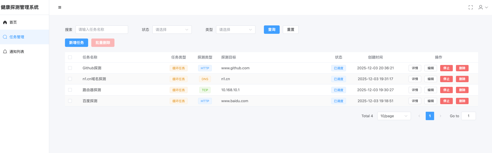

# health-probe

## 项目介绍
使用go实开发的健康探测系统服务后端，支持http、tcp、dns、ping的任务探测。
技术栈：
- 后端：go、gin、viper、zap、gorm、sqlite
- 前端：vue3、element-plus

前端health-web项目地址：https://github.com/hqiaozhi/health-web


## 功能介绍
- 支持http、tcp、dns、ping的任务探测
- 支持任务的添加、删除、修改、查询
- 支持健康检查接口，返回任务的健康状态ok
- 支持Metrics接口，返回任务的健康状态指标，可接入Prometheus等监控系统
- 自带邮件告警功能
  - 如创建任务配置条件，满足5分钟失败超过2次，自动发送失败邮件通知
  - 如任务恢复正常，持续10分分钟无失败，自动发送恢复邮件通知
- 程序重启会自动加载数据库任务到调度器运行

## 配置文件
自动加载配置文件，优先级为：
- /etc/health-probe/config.yaml
- ./config.yaml
```bash
app:
    env: dev
    name: health-probe
    host: 0.0.0.0
    port: 8080
    version: v1.0.0
db:
    gorm:
        conn_max_idle_time: 10m
        conn_max_lifetime: 1h
        log_mode: silent
        max_idle_conns: 3
        max_open_conns: 5
        slow_threshold: 200ms
    sqlite:
        auto_migrate: true
        cache_size: 4096
        disable_foreign_key: true
        journal_mode: WAL
        path: ./health-probe.db
        synchronous: FULL
email:
    from: 11111111@qq.com
    password: 456dfa56df4aaewfewaef
    smtp_server: smtp.qq.com:587
    username: 11111111@qq.com
gin:
    idle_timeout: 15s
    max_multipart_memory: 10485760
    mode: debug
    read_timeout: 5s
    write_timeout: 10s
jwt:
    audience: api-users
    expire_hours: 2
    issuer: health-probe
    refresh_hours: 24
    secret_key: default-secret-key-32bytes-long-1234
    signing_method: HS256
log:
    log_add_caller: true
    log_color: true
    log_compress: false
    log_dir: /var/logs/health-probe/
    log_file: health-probe.log
    log_level: info
    log_max_age: 7
    log_max_backups: 3
    log_max_size: 100
login:
    admin_password: admin123
    admin_user: admin
    users: []
```


## 项目快速开始

```bash
git clone https://github.com/hqiaozhi/health-probe.git
cd health-probe
# 创建配置文件config.yaml之后，执行以下命令开始项目
go mod tidy
go run main.go
```

## 界面展示

更多界面请前往前端项目查看：https://github.com/hqiaozhi/health-web